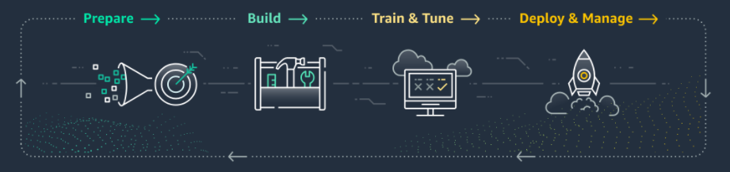

## Machine Learning Lifecycle

**Machine learning (ML)** development is a complex and iterative process. But you can generalize an ML life cycle as having four broad stages:
* Prepare
* Build
* Train & Tune
* Deploy & Monitor

### Prepare Stage
The first is the **Prepare** stage, which takes up the majority of ML teams’ time. A 2016 Forbes study showed 80% of ML engineering team’s time is spent preparing data. Data preparation is tedious, resource and time-intensive because data is often "dirty" and not ready for Machine Learning in its raw form. “Dirty” data could include missing or erroneous values, outliers and other barriers that can impact an ML model. 

Although data can be “dirty”, ML teams still need time to explore and gain understanding of their data through visualizations and analysis. Once they have a good understanding of their data, they can apply **feature engineering** to transform the raw data into valuable inputs. Every unique attribute of the data is considered a `feature``. In our case, each booking record contains features such as the arrival date` and `time of checking in`, `length of stay`, `number of guests`, and so on. Feature engineering selects and transforms variables to create a predictive model. Because the quality of features impacts the quality of the model, feature is a critical part of the ML workflow.

### Build Stage
The second is the **Build** stage. There is where ML teams choose the right ML algorithm, which is often done by trial and error. Even ML teams with deep industry and domain knowledge have to explore the performance of different algorithms in creating a model on a data set. ML teams may also build their own algorithms or neural networks using many different deep learning frameworks. 

### Train & Tune Stage
Now that you have your cleaned data set and have chosen an algorithm, you can move to the **Train & Tune** stage. Here you create a model based on your data and algorithm. Depending on your algorithm, you may want to **tune** different hyperparameters to improve the quality of your model. This often requires time because of thousands of different combinations you can adjust to change the model results.

### Deploy & Monitor Stage
When you are satisfied with your model, you are ready to **Deploy & Monitor**. You deploy your model to production to serve real-time inference or produce predictions in batch. Also, you will want to monitor your model and scale it to meet the demands of your end-users. 

This workshop will focus on the **Prepare** stage when ML teams prepare data and engineer features to produce the best model.