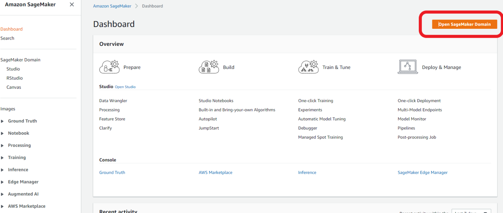
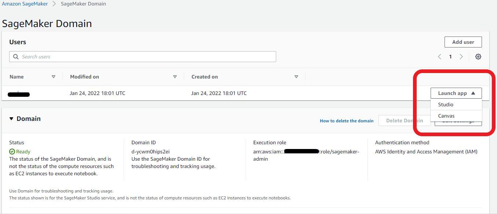
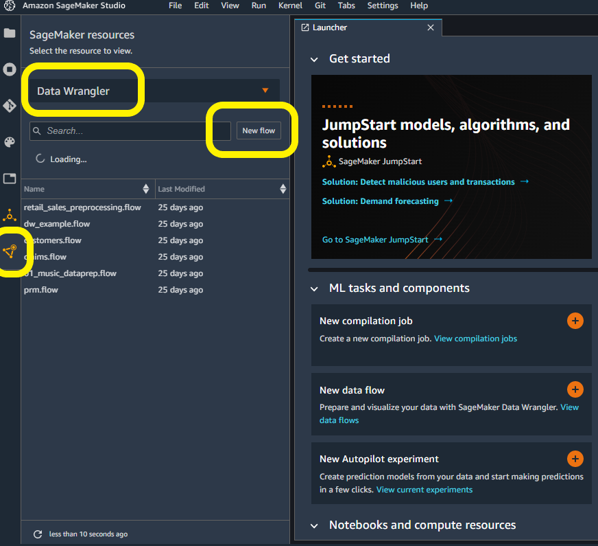
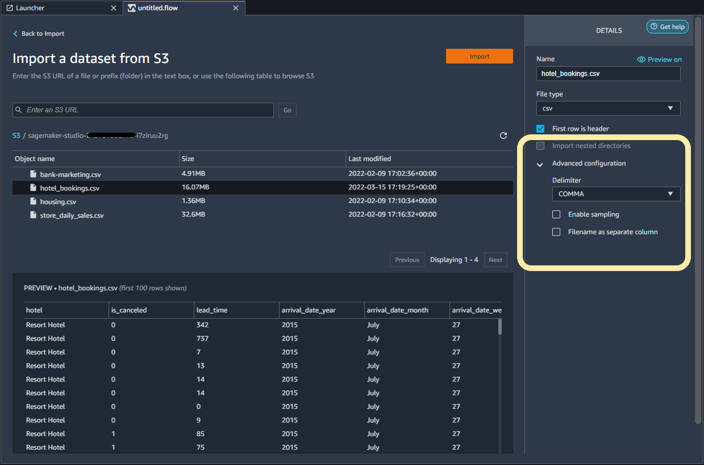

### Getting Started with Data Wrangler

Let’s get started with Data Wrangler. In the AWS Management Console, head over to the SageMaker page. On the dashboard page, select **Open SageMaker Domain.**

You should see a user associated with a domain. Select **Launch app**, and then **Studio** from the user profile.

You will be redirected to SageMaker Studio. You can see all the SageMaker Studio has to offer. For now, select the triangle icon on the left-hand side for **SageMaker resources**. Then, select **Data Wranger** from the drop-down menu as a new SageMaker resource. Select **new flow** to initialized Data Wrangler. This can take a few minutes to complete. Refer to the screenshot if you need help. 

Once initialized, you will have the option to select your data source. Because our data is in Amazon S3, select **Amazon S3** to import data. Navigate to the S3 bucket and then the hotel books CSV file path. Data Wrangler will show you a preview of the data. You can specify the file type as CSV on the right side of the IDE. Select **Advanced configurations** then de-select **enable sampling**. Our data set is small enough to run Data Wrangler transformations on the full data set. If you have a large data set, consider using sampling. Finally select **Import** to finishing importing the data.

You’re now set up to start using Data Wrangler!