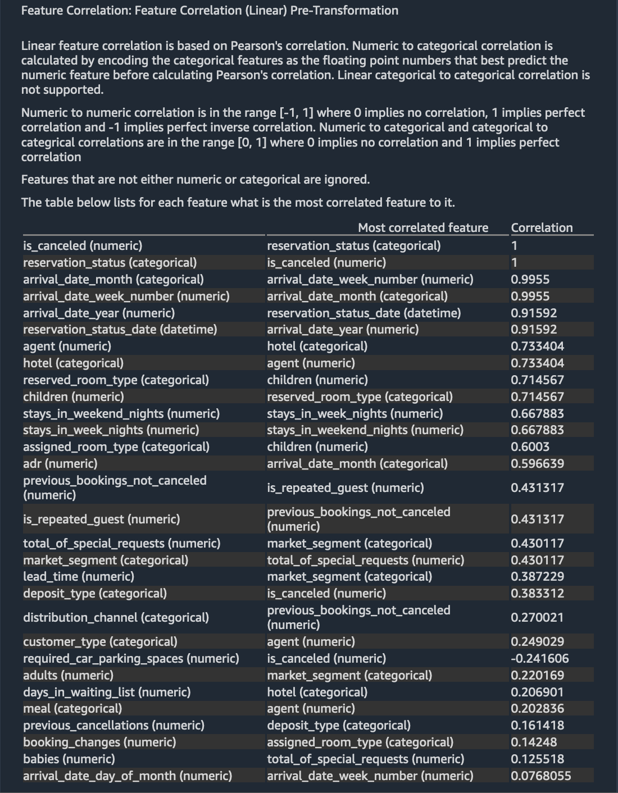
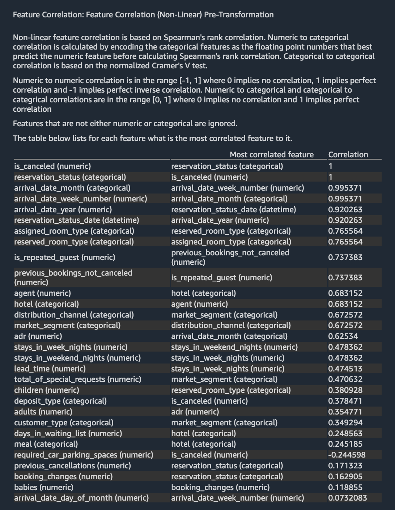
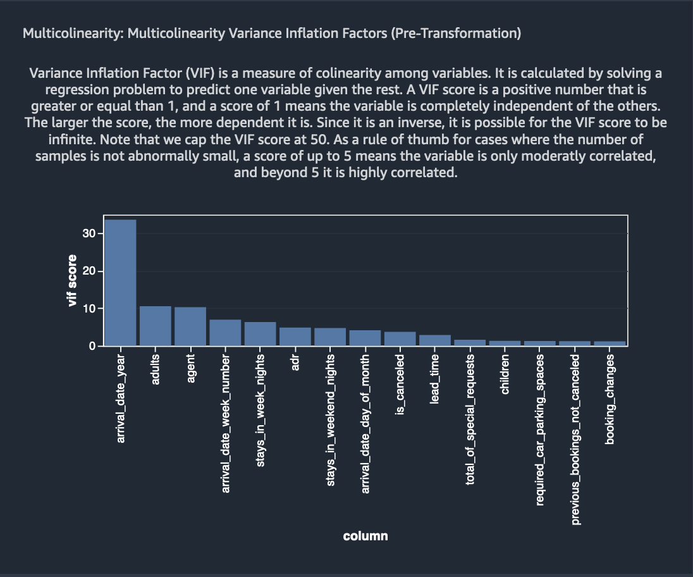
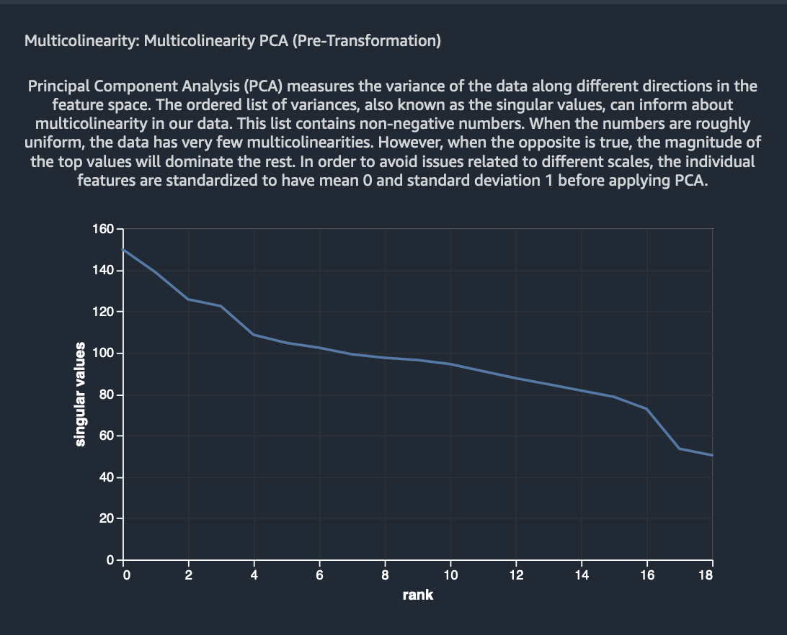
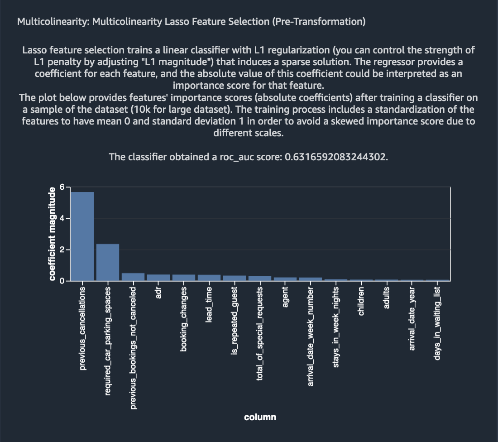
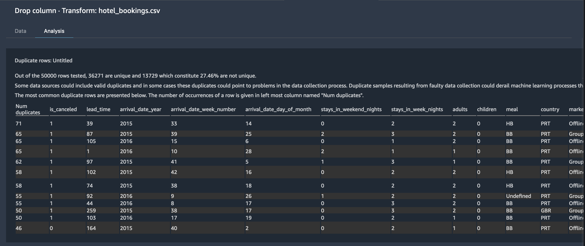
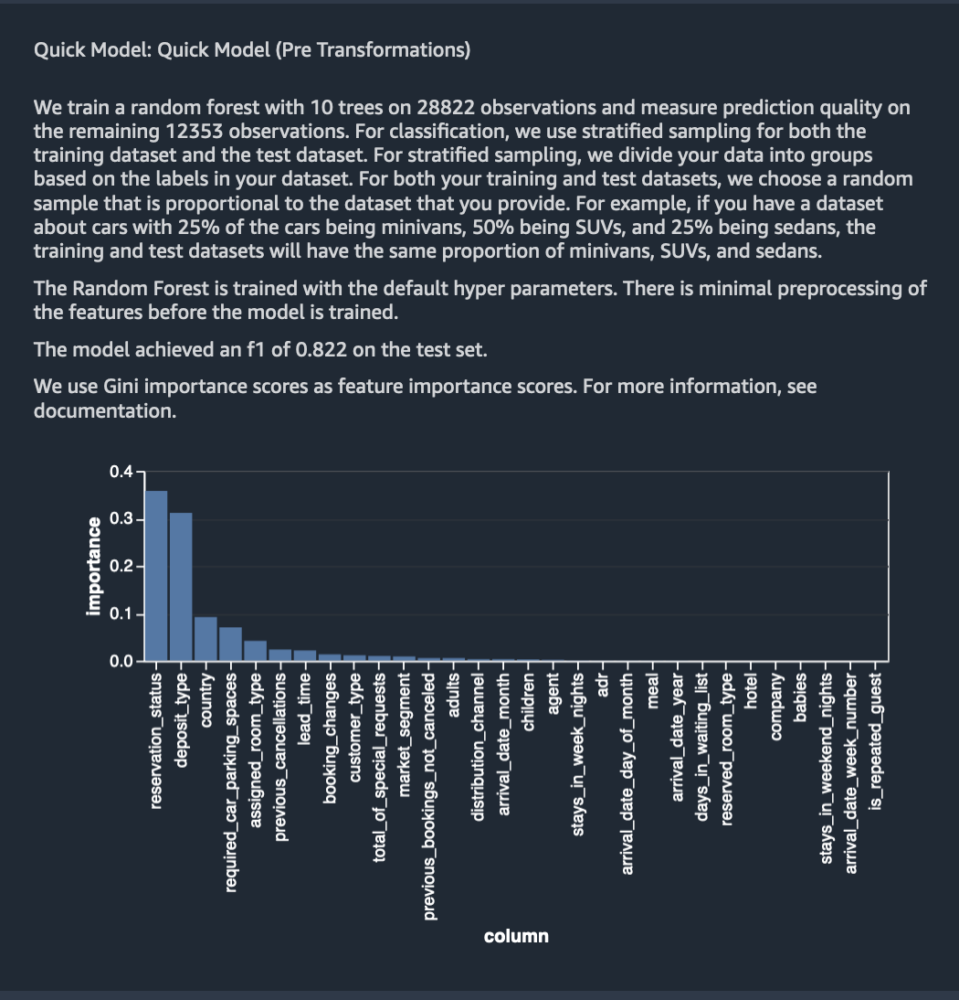

## EDA

### Target Leakage 

### Feature Correlation (Linear)

### Feature Correlation (Non-Linear)

### Multicolinearity Inflation Variance Factors

### Multicolinearity Principal Component Analysis (PCA)

### Multicolinearity Lasso Feature Selection 

### Detect Duplicate Rows

### Quick Model

Let us create a prediction model on the fly using the raw crude features using Data Wrangler's Quick Model option.
A limit of 100,000 rows is used for this analysis. You can use the Quick Model feature to provide a rough estimate of the expected predicted quality and the predictive power of the features in your dataset. We don't recommend using a quick model to fine tune the data preprocessing pipeline or to optimize feature selection.

