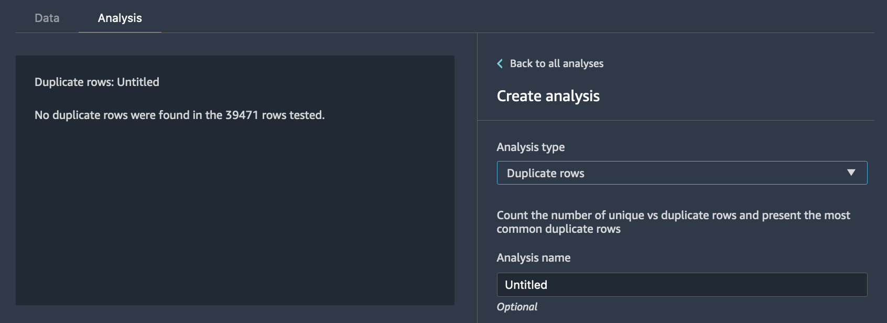
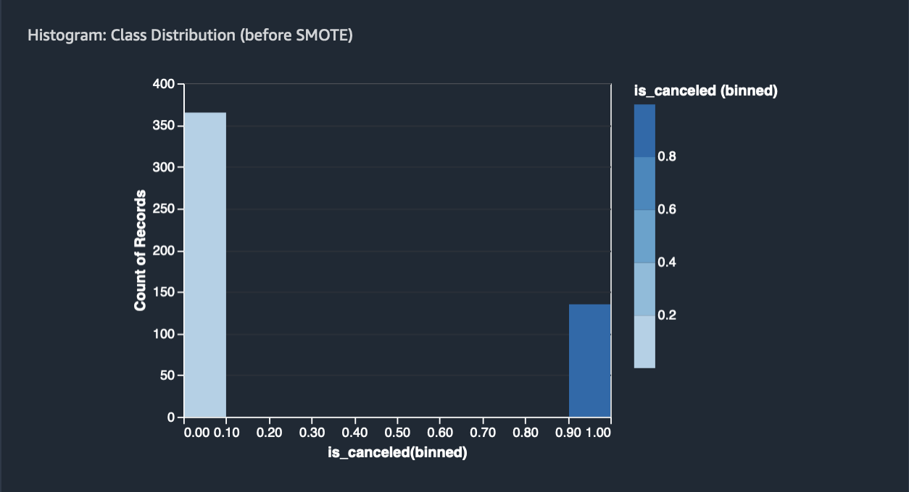
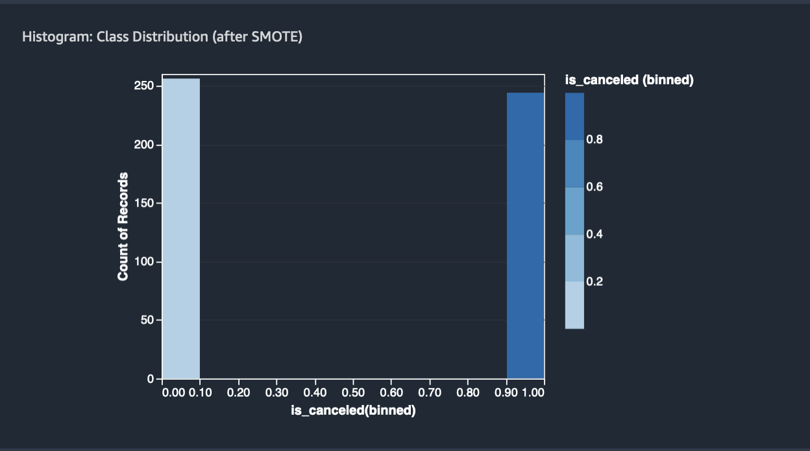
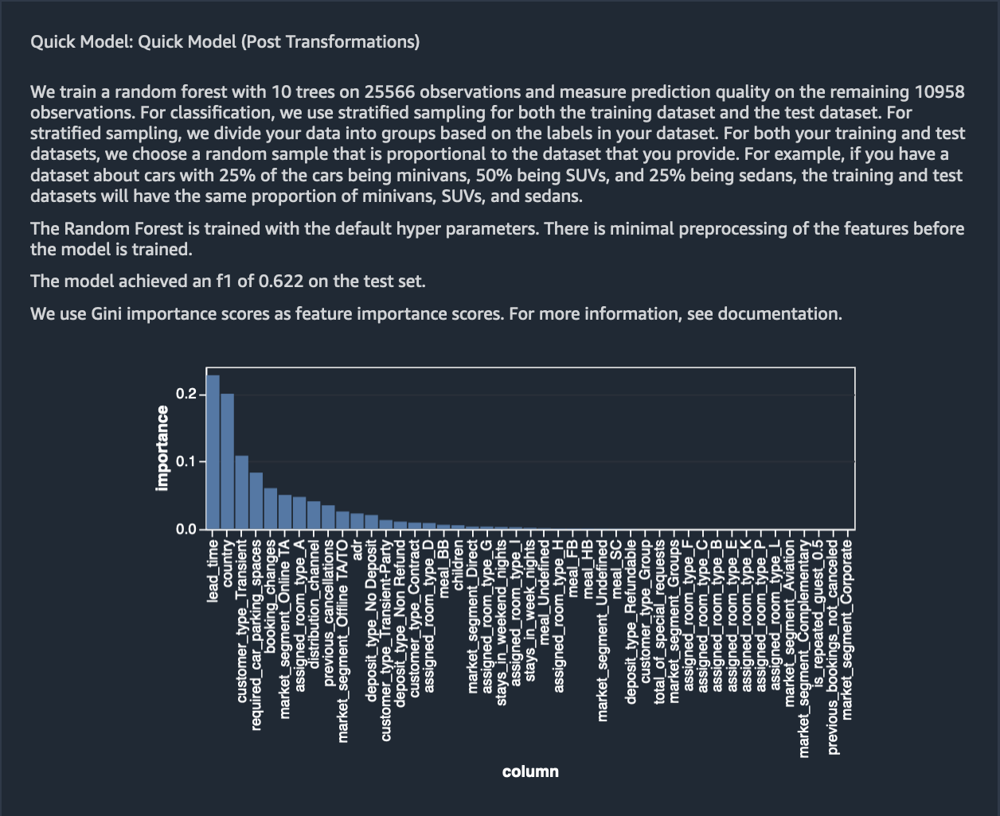

## Transform Data
Amazon SageMaker Data Wrangler provides numerous ML data transforms to streamline cleaning, transforming, and featurizing your data. When you add a transform, it adds a step to the data flow. Each transform you add modifies your dataset and produces a new dataframe. All subsequent transforms apply to the resulting dataframe.

Data Wrangler includes built-in transforms, which you can use to transform columns without any code. You can also add custom transformations using PySpark, Pandas, and PySpark SQL. Some transforms operate in place, while others create a new output column in your dataset.

You can apply transforms to multiple columns at once. For example, you can delete multiple columns in a single step.

You can apply the process numeric and handle missing transforms only to a single column.

Use this page to learn more about these built-in and custom transforms.


### Drop Columns 
 drop columns based on the analyses we performed in the previous section. 

 
 based on target leakage
 
 drop `reservation_status`
 
 drop 7 columns that are redundant - `days_in_waiting_list`, `hotel`, `reserved_room_type`, `arrival_date_month`, `reservation_status_date`, `babies` and `arrival_date_day_of_month`
 
 
 
 based on linear correlation results 
 
 `arrival_date_week_number`
 `arrival_date_year` is greater than the recommended threshold of `0.90`
 
 
 based on non-linear correlation results
 we need to drop `reservation_status`
 
we had already dropped it since it was also a target leakage 


based on multi-colinearity results 

VIF > 5
drop columns `adults`, `agents`

### Drop duplicate columns 

 
 
 
### handle outliers 


### Handle missing values 

children replace with 0 based on value counts 

company column ?


Fill missing country column with `PRT` based on value counts 

Custom Transform - Meal type has Undefined category, changing the Undefined value to the most used which is BB by implementing a custom pyspark transform with two simple lines of code

```python
from pyspark.sql.functions import when

df = df.withColumn('meal', when(df.meal == 'Undefined', 'BB').otherwise(df.meal))
```

Standardize numeric outliers 

`lead_time`, `stays_weekend_nights`, `stays_weekend_nights`, `is_repeated_guest`, `prev_cancellations`, `prev_bookings_not_canceled`, `booking_changes`, `adr`, `total_of_specical_requests`, `required_car_parking_spaces`


Handle categorical data
`meal`, `is_repeated_guest`, `market_segment`, `assigned_room_type`, `deposit_type`, `customer_type`


 


### Balancing the target variable 

`is_canceled` = 0 (negative case)
`is_canceled` = 1 (positive case)

The ratio of positive to negative case = ~0.38


Balance using under/over sampling or SMOTE 
After balancing, the ratio is 1 



### Quick Model 



For more information on the different types of transformations Data Wrangler offers, visit the official documentation  