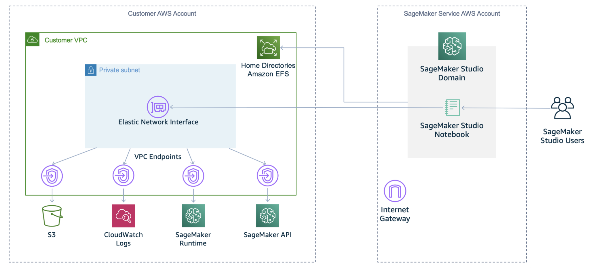
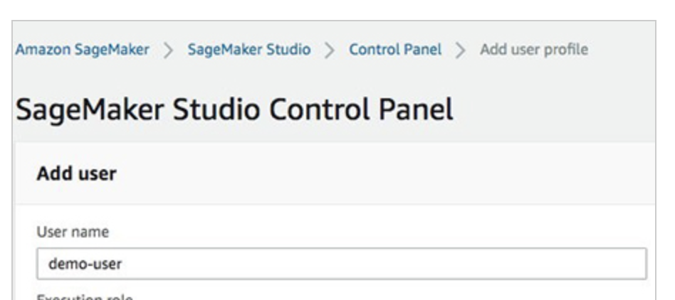

# VPC/Private access


Overview
Amazon SageMaker Studio runs in its own AWS managed account. You can securely access the Studio notebook over Amazon’s private network using an [Amazon Virtual Private Cloud](https://aws.amazon.com/vpc) (Amazon VPC) endpoint. In this lab, you will learn how to access Studio Notebook securely from your own VPC or corporate network without public access

## Architecture overview

Below diagram shows how VPC only communication with the internet


## Setting up your environment

**Note**: You can create only one studio domain per region in your account. If you already created any SageMaker studio domain in same region in previous lab,  please delete the domain before setting up this environment:

To better understand how the feature works, we provide an [AWS CloudFormation](http://aws.amazon.com/cloudformation) template to set up a basic environment where you can experiment with Amazon SageMaker Studio running inside a VPC. After deployment, the environment looks like the following diagram.
This template deploys the following resources in your account:

* A new VPC, with a private subnet and security group. Because communication occurs across multiple Studio resources, this security group applied to the Studio ENI should allow inbound traffic to itself.
* An encrypted S3 bucket, with bucket policies restricting access to our S3 endpoint.
* VPC endpoints with policies for access control:
    * We use an Amazon S3 endpoint to demonstrate the ability to limit traffic to specific S3 buckets.
    * Because Studio has its traffic routed through the VPC, access to supporting services needs to be provisioned through VPC endpoints. [Amazon CloudWatch Logs](http://aws.amazon.com/cloudwatch) allows Studio to push logs generated by the service. We need an [Amazon SageMaker API](https://docs.aws.amazon.com/sagemaker/latest/APIReference/API_Operations_Amazon_SageMaker_Service.html) endpoint to launch Studio notebooks, training jobs, processing jobs, and deploy endpoints, and an [Amazon SageMaker RunTime](https://docs.aws.amazon.com/sagemaker/latest/APIReference/API_Operations_Amazon_SageMaker_Runtime.html) endpoint for services to call the Amazon SageMaker inference endpoint.
* An IAM execution role. This role is assigned to Amazon SageMaker and defines which access permissions Studio has.

To set up your environment, click on the link below. The template is also available at this [GitHub repo](https://github.com/aws-samples/amazon-sagemaker-studio-vpc-blog).

## Creating an Amazon SageMaker Studio domain inside a VPC

With the infrastructure in place, you’re ready to create an Amazon SageMaker Studio domain and assign it to a VPC.
For more information about the options available to set up Studio, see [Onboard to Amazon SageMaker Studio.](https://docs.aws.amazon.com/sagemaker/latest/dg/gs-studio-onboard.html) If you have an existing domain, you might want to [delete it](https://docs.aws.amazon.com/sagemaker/latest/dg/gs-studio-delete-domain.html) and recreate it, or create a separate one.
To create the domain, you can use the following:

* The [AWS Command Line Interface](http://aws.amazon.com/cli) (AWS CLI). For instructions, see [create-domain](https://docs.aws.amazon.com/cli/latest/reference/sagemaker/create-domain.html).
* The AWS SDK. For instructions, see [CreateDomain](https://docs.aws.amazon.com/sagemaker/latest/APIReference/API_CreateDomain.html).
* The [AWS Management Console](http://aws.amazon.com/console).

To use the console to create a Studio domain and tie it to the VPC infrastructure deployed by the template, complete the following steps:

1. On the Amazon SageMaker console, choose SageMaker Studio.

If you don’t have a domain created, a screen appears.

1. For Get Started, select Standard setup.
2. For Authentication method, select AWS Identity and Access Management (IAM).
3. For Execution role for all users, choose your notebook IAM role (the default is `studiovpc-notebook-role`).
4. In the Network section, for VPC, choose your VPC (the default is `studiovpc-vpc`).
5. For Subnet, choose your subnet (the default is `studiovpc-private-subnet`).

Make sure to not choose studiovpc-endpoint-private-subnet.

1. For Network Access for Studio, select VPC Only.
2. Choose Submit.


## Creating a user profile

Now that the domain is created, we need to create a user profile. You can create multiple user profiles associated to a single domain.
To create your user profile on the console, complete the following steps:

1. On the Amazon SageMaker Studio console, choose Control Panel.
2. Choose Add user profile.
3. For User name, enter a name (for example, `demo-user`).
4. For Execution role, choose your IAM role (the default is `studiovpc-notebook-role`).




## Accessing Amazon SageMaker Studio

We now have a Studio domain associated to our VPC and a user profile in this domain. Now we need to give access to the user. To do so, we create a pre-signed URL.
To use the console, on the Studio Control Panel, locate your user name and choose Open Studio.
To use the AWS CLI, enter the following code:

`#Now let's create the pre-signed URL
```bash
$ aws sagemaker create-presigned-domain-url --region $REGION --domain-id $DOMAIN_ID --user-profile-name $USER_PROFILE_NAME
```
 
Please take note of the Domain URL, and paste it on a browser that have VPC Connectivity
You can also try login with Windows EC2 instance in the same VPC and access the SageMaker Studio`


